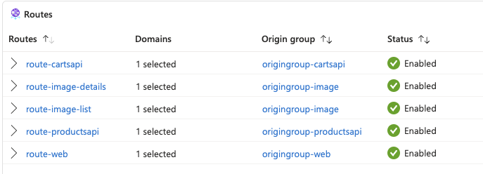

# Contoso Traders Chaos Testing - Architecture

# Component Overview
The application consists of the following components

## Front Door Ingress layer
Front Door is used to provide a single endpoint for incoming requests, while serving various paths to different backend components. The following routes are implemented:

All backend requests go over Internet and are secured using TLS. 

## Frontend website (SPA)
The website is built as a React Single Page Application (SPA) and is hosted as a static site on an Azure Storage Account.

- API Communication: All interactions with backend APIs (Product API and Carts API) happen directly from the client-side browser running the React code.
- Cart: The Cart works using local storage when not authenticated - this is not persisted.
- UI Functionality: You can browse product categories, product detail pages and add products to the cart. There is no checkout implemented.
  
## Products API (AKS and SQL Server)
The Products API handles product-related data and operations.

- Infrastructure: Runs on Azure Kubernetes Service (AKS) and connects to an Azure SQL database for storing product data.
- Storage: Product images are hosted separately on an Azure Storage Account and are not managed by the Products API.
- Security: TLS certificates for AKS are provisioned using Let's Encrypt.

For it to be functioning properly the cosmos DBs for stocks and cart need to be functioning as well.

## Carts API (ACA and CosmosDB)
When a user adds an item to their cart, this is stored in the CosmosDB Carts database. Requests are sent to the Carts API, running as an application on Azure Container Apps. 
During deployment an empty (Hello World) image is deployed to ACA, because it cannot be empty. After resource deployment, the actual image from the Container Registry is retrieved. 

## Product images and details on storage
Product images and details are stored on static websites on storage accounts and directly included in the website.

## Entra ID for authentication
Users can authenticate on the website using MSAL, although this is not needed to browse items. It currently only serves to retrieve a user identifier for storing carts. 
If the user is not authenticated, carts data is only stored locally in the browser. 
In order for authentication to work, an Entra Application must be created. 
The ID of this application must be passed to the deployment in the WEBSITE_CLIENTID and ENTRA_AUTHORITY variables. These replace the .env.production variables in the UI folder.
Additionally, the URL of the application (shown on the deployment summary page) needs to be added to the application as a redirect URI for authentication:

# Architecture Diagram

